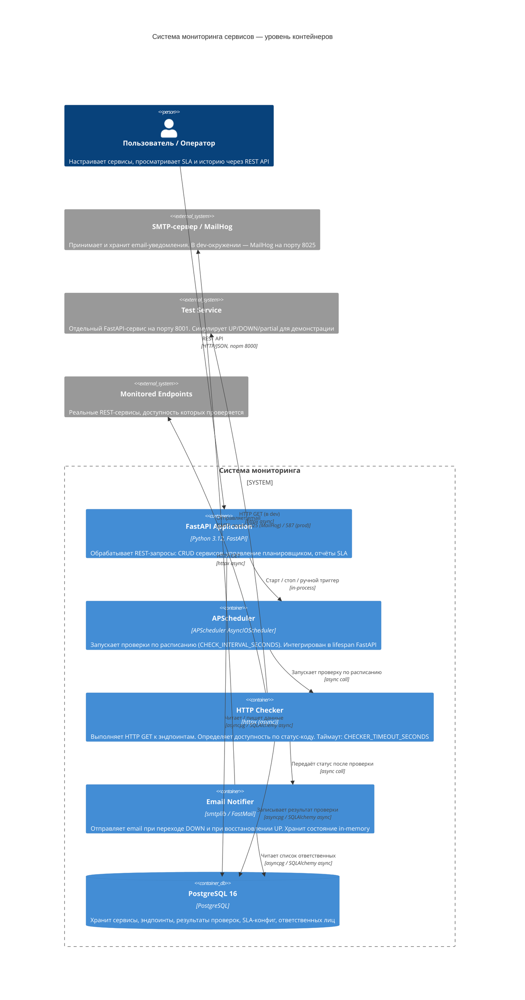
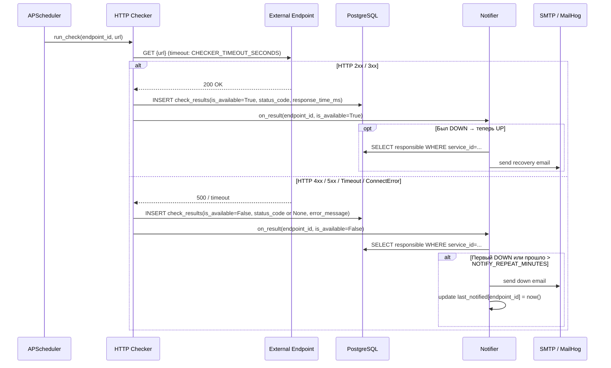
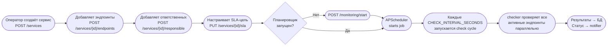
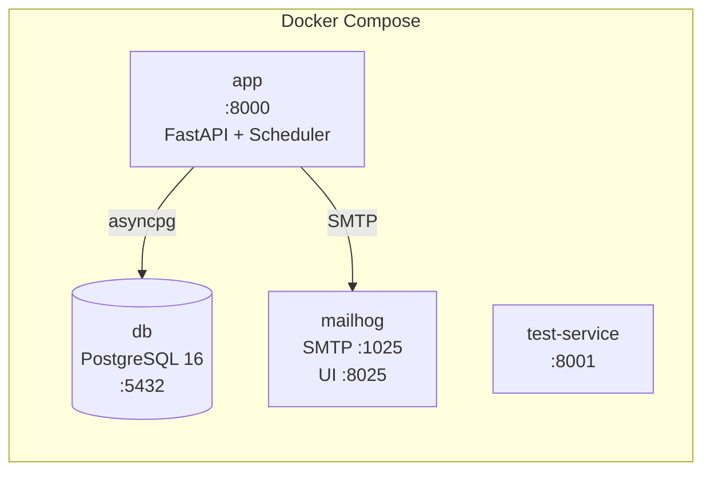

# Архитектура системы мониторинга сервисов

## Назначение

Система мониторинга REST-эндпоинтов для СБЕР. По расписанию проверяет доступность сервисов, хранит историю проверок, считает SLA и отправляет email-уведомления ответственным при падении сервиса.

---

## C4-диаграмма (уровень контейнеров)



---

## Границы модулей

```
app/
├── api/              # FastAPI роутеры — принимают HTTP-запросы, возвращают ответы
│   ├── services.py   #   CRUD: сервисы, эндпоинты, ответственные, SLA-конфиг
│   ├── monitoring.py #   Управление планировщиком: старт, стоп, ручной триггер
│   └── reports.py    #   Отчёты: история проверок, текущий SLA, дашборд
│
├── scheduler/        # APScheduler — инициализация, lifespan-интеграция, job-регистрация
│
├── checker/          # Движок HTTP-проверок
│   └── engine.py     #   check_endpoint(): выполняет запрос, определяет is_available
│
├── notifier/         # Email-уведомления
│   └── email.py      #   notify_down(), notify_recovery(); состояние last_notified in-memory
│
├── models/           # SQLAlchemy ORM-модели (таблицы БД)
├── schemas/          # Pydantic-схемы запросов (XxxRequest) и ответов (XxxResponse)
├── repositories/     # Слой доступа к БД (select/insert/update через AsyncSession)
├── db/               # SessionLocal, Base, get_db dependency
└── main.py           # Точка входа: создание app, подключение роутеров, lifespan
```

---

## Поток данных

### Плановая проверка эндпоинта



### Конфигурация → первый цикл проверок



---

## Технологический стек

| Слой | Технология | Назначение |
|------|-----------|------------|
| Web-фреймворк | FastAPI 0.11x | REST API, Swagger UI, dependency injection |
| ORM | SQLAlchemy 2.x (async) | Работа с БД через async-сессии |
| Миграции | Alembic | Версионирование схемы БД |
| Планировщик | APScheduler `AsyncIOScheduler` | Периодический запуск проверок |
| HTTP-клиент | httpx (async) | Проверка эндпоинтов |
| СУБД | PostgreSQL 16 | Хранение данных |
| Email | smtplib / FastMail | Отправка уведомлений |
| Логирование | structlog | Структурированные JSON-логи |
| Тесты | pytest, respx, testcontainers | Unit и интеграционные тесты |
| Линтеры | ruff, black, mypy | Качество и типизация кода |
| Инфраструктура | Docker Compose | Оркестрация: app, db, mailhog, test-service |

---

## Правила определения доступности

| Ответ эндпоинта | `is_available` | `status_code` | `error_message` |
|-----------------|---------------|--------------|----------------|
| HTTP 2xx / 3xx | `True` | код ответа | `null` |
| HTTP 4xx / 5xx | `False` | код ответа | `null` |
| `httpx.TimeoutException` | `False` | `null` | текст исключения |
| `httpx.ConnectError` | `False` | `null` | текст исключения |

---

## Расчёт SLA

```
sla_percent = (кол-во is_available=True за 30 дней / всего проверок за 30 дней) × 100
```

- Период: скользящие 30 дней от текущего момента
- Если проверок нет — возвращается `null`, не `0` и не `100`
- Целевой SLA: из `sla_config.target_percent`, дефолт `99.0`

Критичный индекс для производительности:
```sql
CREATE INDEX ix_check_results_endpoint_checked ON check_results(endpoint_id, checked_at);
```

---

## Логика уведомлений

```
Переход UP → DOWN:    отправить email DOWN немедленно
Продолжает DOWN:      повторный email, если прошло > NOTIFY_REPEAT_MINUTES
Переход DOWN → UP:    отправить email RECOVERY
```

Состояние `last_notified[endpoint_id]` хранится in-memory (сброс при рестарте — допустимо для MVP).

---

## Инфраструктура (Docker Compose)



| Сервис | Порт | Назначение |
|--------|------|-----------|
| `app` | 8000 | FastAPI приложение + Swagger UI |
| `db` | 5432 | PostgreSQL 16 |
| `mailhog` | 1025 / 8025 | SMTP-приёмник / веб-интерфейс писем |
| `test-service` | 8001 | Тестовый сервис с симуляцией падений |
