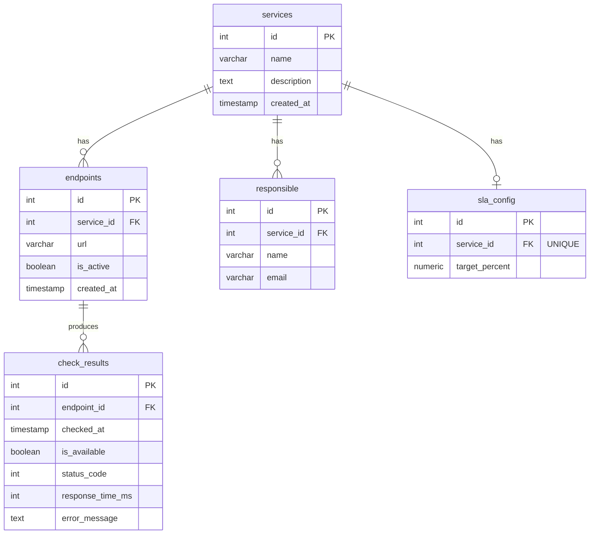

# Схема базы данных

## ER-диаграмма



---

## Таблицы

### `services`

Реестр сервисов, доступность которых отслеживается.

| Колонка | Тип | Ограничения | Описание |
|---------|-----|-------------|----------|
| `id` | `SERIAL` | `PRIMARY KEY` | Суррогатный ключ |
| `name` | `VARCHAR(255)` | `NOT NULL` | Человекочитаемое название сервиса |
| `description` | `TEXT` | `NULLABLE` | Описание сервиса |
| `created_at` | `TIMESTAMP WITH TIME ZONE` | `NOT NULL`, `DEFAULT now()` | Время регистрации сервиса |

---

### `endpoints`

Конкретные URL-адреса, которые проверяются планировщиком.

| Колонка | Тип | Ограничения | Описание |
|---------|-----|-------------|----------|
| `id` | `SERIAL` | `PRIMARY KEY` | Суррогатный ключ |
| `service_id` | `INTEGER` | `NOT NULL`, `FK → services(id)` | Принадлежность к сервису |
| `url` | `VARCHAR(2048)` | `NOT NULL` | Полный URL эндпоинта |
| `is_active` | `BOOLEAN` | `NOT NULL`, `DEFAULT true` | Флаг активности: `false` — исключить из проверок |
| `created_at` | `TIMESTAMP WITH TIME ZONE` | `NOT NULL`, `DEFAULT now()` | Время добавления эндпоинта |

**Поведение при удалении:** `ON DELETE CASCADE` — удаление сервиса удаляет все его эндпоинты (и каскадно — их `check_results`).

---

### `responsible`

Список ответственных лиц, которые получают email-уведомления при падении сервиса.

| Колонка | Тип | Ограничения | Описание |
|---------|-----|-------------|----------|
| `id` | `SERIAL` | `PRIMARY KEY` | Суррогатный ключ |
| `service_id` | `INTEGER` | `NOT NULL`, `FK → services(id)` | Принадлежность к сервису |
| `name` | `VARCHAR(255)` | `NOT NULL` | Имя ответственного |
| `email` | `VARCHAR(255)` | `NOT NULL` | Email для уведомлений |

**Поведение при удалении:** `ON DELETE CASCADE` — удаление сервиса удаляет всех его ответственных.

---

### `sla_config`

Целевой SLA для каждого сервиса. Одна запись на сервис.

| Колонка | Тип | Ограничения | Описание |
|---------|-----|-------------|----------|
| `id` | `SERIAL` | `PRIMARY KEY` | Суррогатный ключ |
| `service_id` | `INTEGER` | `NOT NULL`, `FK → services(id)`, `UNIQUE` | Принадлежность к сервису (1:1) |
| `target_percent` | `NUMERIC(5,2)` | `NOT NULL`, `DEFAULT 99.0` | Целевой SLA в процентах, например `99.0` или `99.9` |

**Поведение при удалении:** `ON DELETE CASCADE` — удаление сервиса удаляет его SLA-конфиг.

**Примечание:** `UNIQUE(service_id)` гарантирует не более одной записи на сервис. Для создания или обновления конфига используется `INSERT ... ON CONFLICT DO UPDATE` (upsert).

---

### `check_results`

История всех проверок эндпоинтов. Основная таблица для расчёта SLA и отображения истории.

| Колонка | Тип | Ограничения | Описание |
|---------|-----|-------------|----------|
| `id` | `SERIAL` | `PRIMARY KEY` | Суррогатный ключ |
| `endpoint_id` | `INTEGER` | `NOT NULL`, `FK → endpoints(id)` | Какой эндпоинт проверялся |
| `checked_at` | `TIMESTAMP WITH TIME ZONE` | `NOT NULL`, `DEFAULT now()` | Время начала проверки |
| `is_available` | `BOOLEAN` | `NOT NULL` | Результат: `true` = UP, `false` = DOWN |
| `status_code` | `INTEGER` | `NULLABLE` | HTTP-статус ответа. `NULL` при сетевой ошибке |
| `response_time_ms` | `INTEGER` | `NULLABLE` | Время ответа в миллисекундах. `NULL` при ошибке |
| `error_message` | `TEXT` | `NULLABLE` | Текст исключения при сетевой ошибке |

**Поведение при удалении:** `ON DELETE CASCADE` — удаление эндпоинта удаляет всю его историю проверок.

---

## Индексы

| Индекс | Таблица | Колонки | Тип | Назначение |
|--------|---------|---------|-----|-----------|
| `pk_services` | `services` | `id` | `PRIMARY KEY` | Автоматически |
| `pk_endpoints` | `endpoints` | `id` | `PRIMARY KEY` | Автоматически |
| `pk_responsible` | `responsible` | `id` | `PRIMARY KEY` | Автоматически |
| `pk_sla_config` | `sla_config` | `id` | `PRIMARY KEY` | Автоматически |
| `pk_check_results` | `check_results` | `id` | `PRIMARY KEY` | Автоматически |
| `uq_sla_config_service` | `sla_config` | `service_id` | `UNIQUE` | Один SLA-конфиг на сервис |
| **`ix_check_results_endpoint_checked`** | `check_results` | `(endpoint_id, checked_at)` | `BTREE` | **Критичный индекс для SLA-запросов** |

### Почему индекс `(endpoint_id, checked_at)` критичен

SLA рассчитывается следующим запросом:

```sql
SELECT
  COUNT(*) FILTER (WHERE is_available = true) AS up_count,
  COUNT(*) AS total_count
FROM check_results
WHERE endpoint_id = :endpoint_id
  AND checked_at >= now() - INTERVAL '30 days';
```

Без индекса PostgreSQL делает `Seq Scan` по всей таблице. При частых проверках (каждую минуту, 100 эндпоинтов) за год накапливается ~52 млн строк — запрос займёт секунды. Составной индекс `(endpoint_id, checked_at)` позволяет выполнить `Index Scan` за миллисекунды.

Создаётся в первой миграции Alembic:

```python
Index("ix_check_results_endpoint_checked", CheckResult.endpoint_id, CheckResult.checked_at)
```

---

## Связи и CASCADE-поведение

```
services (1) ──── (N) endpoints    ON DELETE CASCADE
services (1) ──── (N) responsible  ON DELETE CASCADE
services (1) ──── (1) sla_config   ON DELETE CASCADE
endpoints (1) ─── (N) check_results ON DELETE CASCADE
```

Удаление сервиса через `DELETE FROM services WHERE id = :id` автоматически удалит:
1. Все эндпоинты сервиса
2. Всю историю проверок этих эндпоинтов
3. Всех ответственных сервиса
4. SLA-конфиг сервиса

---

## DDL (справочный)

```sql
CREATE TABLE services (
  id          SERIAL PRIMARY KEY,
  name        VARCHAR(255) NOT NULL,
  description TEXT,
  created_at  TIMESTAMPTZ NOT NULL DEFAULT now()
);

CREATE TABLE endpoints (
  id         SERIAL PRIMARY KEY,
  service_id INTEGER NOT NULL REFERENCES services(id) ON DELETE CASCADE,
  url        VARCHAR(2048) NOT NULL,
  is_active  BOOLEAN NOT NULL DEFAULT true,
  created_at TIMESTAMPTZ NOT NULL DEFAULT now()
);

CREATE TABLE responsible (
  id         SERIAL PRIMARY KEY,
  service_id INTEGER NOT NULL REFERENCES services(id) ON DELETE CASCADE,
  name       VARCHAR(255) NOT NULL,
  email      VARCHAR(255) NOT NULL
);

CREATE TABLE sla_config (
  id             SERIAL PRIMARY KEY,
  service_id     INTEGER NOT NULL UNIQUE REFERENCES services(id) ON DELETE CASCADE,
  target_percent NUMERIC(5,2) NOT NULL DEFAULT 99.0
);

CREATE TABLE check_results (
  id               SERIAL PRIMARY KEY,
  endpoint_id      INTEGER NOT NULL REFERENCES endpoints(id) ON DELETE CASCADE,
  checked_at       TIMESTAMPTZ NOT NULL DEFAULT now(),
  is_available     BOOLEAN NOT NULL,
  status_code      INTEGER,
  response_time_ms INTEGER,
  error_message    TEXT
);

-- Критичный индекс для SLA-запросов
CREATE INDEX ix_check_results_endpoint_checked
  ON check_results(endpoint_id, checked_at);
```
